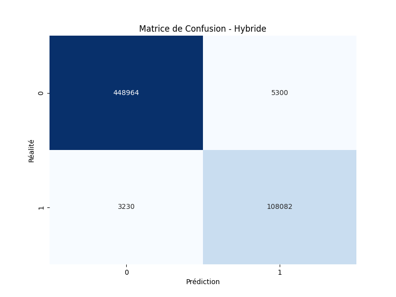
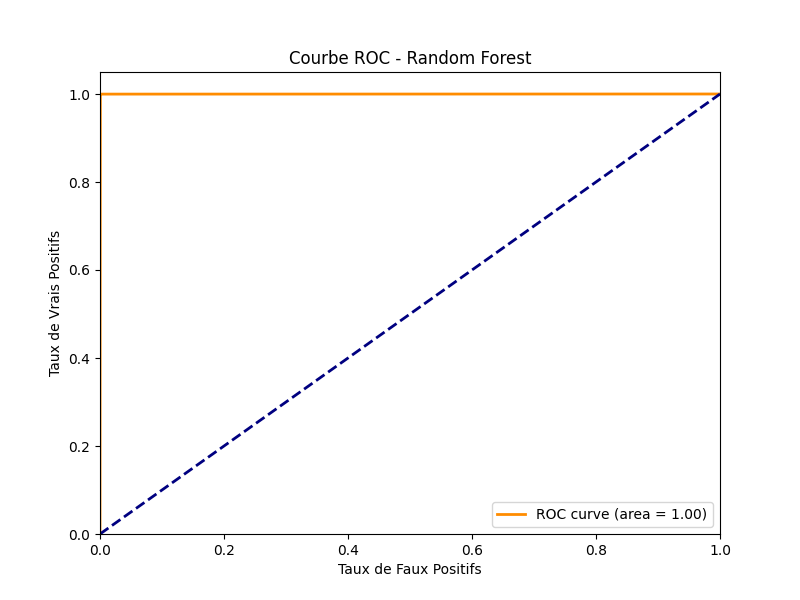
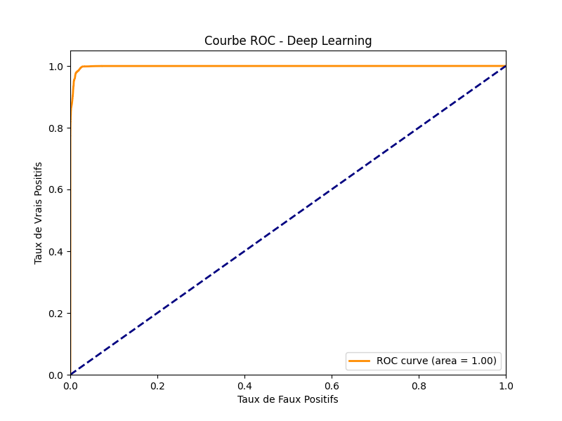

# 🛡️ IDS-Benchmark: Comparatif ML/DL pour la Cybersécurité

Comparaison des performances des architectures de détection d'intrusions (IDS) sur des datasets historiques et modernes.

## 📊 Données & Téléchargements
Les datasets étant volumineux, ils ne sont pas inclus dans le dépôt git.
* **Dataset Actuel du Benchmark** : `CIC_IDS2017`

### 📥 Comment obtenir les données ?
1.  Créez un dossier `data/` à la racine du projet.
2.  Téléchargez les fichiers CSV depuis les sources officielles :
    * **NSL-KDD** : [Télécharger ici (UNB)](https://www.kaggle.com/datasets/hassan06/nslkdd)
    * **CIC-IDS2017** : [Télécharger ici (UNB)](https://www.kaggle.com/datasets/chethuhn/network-intrusion-dataset)
3.  Placez les fichiers (ex: `KDDTrain+.txt` ou `Wednesday-workingHours.pcap_ISCX.csv`) dans les sous-dossiers correspondants (`data/nsl_kdd/` ou `data/cic_ids2017/`).

### 🧠 Modèles Pré-entraînés
Les modèles entraînés (`.joblib` et `.keras`) sont disponibles dans la section **[Releases](../../releases)** de ce dépôt GitHub pour éviter de tout ré-entraîner.

## 🚀 Installation & Usage
```bash
git clone [https://github.com/16Flavio/AI-IDS-Benchmark.git](https://github.com/16Flavio/AI-IDS-Benchmark.git)
pip install -r requirements.txt

# A. Entraîner les modèles (Si vous avez téléchargé les données)
python main.py --mode train --dataset cic_ids2017

# B. Évaluer et générer ce rapport
python main.py --mode eval --dataset cic_ids2017

# C. Simulation Temps Réel (Dashboard SOC)
python main.py --mode sim --dataset cic_ids2017
```

## 📈 Résultats de l'Évaluation (07/01/2026 à 20:01)

### Performance Globale
| Modèle | Précision | F1-Score | Temps (s) |
| :--- | :--- | :--- | :--- |
| **Random Forest** | 99.89% | 0.9972 | 3.8106 |
| **Deep Learning** | 98.49% | 0.9620 | 2.9381 |
| **Hybride** | 98.49% | 0.9620 | 17.2677 |
| **Traditionnel (Règles)** | 80.12% | 0.0004 | 14.6744 |
| **Auto-Encoder (Zero-Day)** | 84.92% | 0.5344 | 25.6617 |
| **XGBoost** | 99.92% | 0.9980 | 0.4572 |


### 🔍 Matrices de Confusion
| Random Forest | Deep Learning |
| :---: | :---: |
|  |  |

| XGBoost | Hybride (IA + Règles) |
| :---: | :---: |
|  |  |

### 📉 Courbes ROC
| Random Forest | Deep Learning |
| :---: | :---: |
|  |  |
